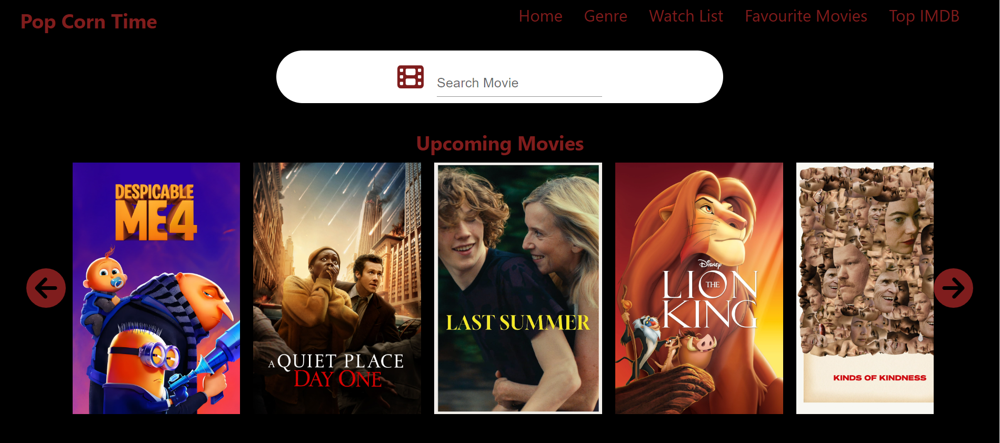

# POP CORN TIME
    Pop corn time is the Web application which you can able to see the details of the movies and watch a trailer of the movie which is build using React , TMDB API and Backend.

    This React app project is about building an app using React and apply the concepts and technique that we learned in class.

    - Learned  useEffect, useNavigate, Link and Routing
    - Using an API for accesing the data from the external source using axios
    - GET, POST and DELETE method in axios 
    - deploying repository in netlify and render web Service
    - Link was helpful to navigate through pages and instead of button used Link in lot of places
    - Deep learning in Tailwind CSS and used some components from Material UI
    -Used Skeleton structure while data loading.

 

## Contributions

Welcome any kind of contributions!
1. If you encounter any kind of bugs or need to improve on code or style feel free to comunicate.
2. If your a developer want to add more feautre your welcome fork ,clone and push it
3. All kind of comment and ideas are welcome